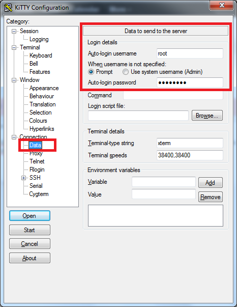
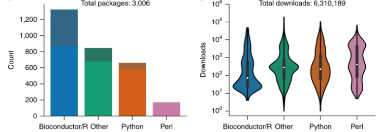

<style>
#TOC {
  color: black;
  font-familiy: Calibri;
  font-size: 14px;
  border-color: #708090; 
}
body {
   color: black;
   font-familiy: Calibri;
}

pre {
  color: black;
  background-color: #F8F8FF;
}
# header {
  color: #800000;
  font-familiy: Calibri;
  background-color: #F5F5F5;
  opacity: 0.8;
  font-size: 16px;
}
</style>
---

```{r setup, include=FALSE}
knitr::opts_chunk$set(echo = TRUE)
```

## SHELL DE UNIX

Una **Shell de Unix** o también **shell**, es el término usado en informática para referirse a un intérprete de comandos, el cual consiste en la interfaz de usuario tradicional de los sistemas operativos basados en Unix y similares, como GNU/Linux (https://es.wikipedia.org/wiki/Shell_de_Unix).

Este interprete de comandos es el ambiente de trabajo base de la bioinformática y, por lo tanto, de todos los científicos y profesionales que trabajan en genética y genómica aplicada.

En términos simples Shell permite controlar un ordenador y ejecutar un programa (software, paquete o librería) basado en una interfaz de texto.

#### Ventajas de usar Shell

**Conectividad y acceso remoto:** El uso de Shell facilita la conectividad y el acceso remoto a recursos computacionales desde cualquier parte del mundo. 

**Multitareas:** Es posible ejecutar múltiples tareas como copiar archivos, instalar software, enviar, monitorear y realizar tareas y análisis, almacenar los resultados o datos.

**Reproducibilidad:** Los procesos realizados mediante la línea de comandos son muy fáciles de documentar puesto que tan sólo debemos guardar el texto que hemos introducido en la pantalla.

**Velocidad:** Los programas que funcionan en línea de comandos suelen ser extraordinariamente livianos y rápidos, al contrario de software que funcionen con interfaz gráfica.

**Transmisión eficiente de flujos de información:** Permite transmitir mediante pipe o tuberías flujos de trabajo o procesos, donde el resultado de un proceso es usado por otro programa.

#### VERSIONES DE SHELL Y EL TERMINAL 

**Bourne shell (sh)**: desarrollado por Stephen Bourne de los Laboratorios Bell de AT&T. en 1977, aun es muy popular. Los archivos ejecutables tiene extensión .sh

**Bourne Again shell (bash)**:  Desarrollado en 1989 por Brian Fox para el Proyecto de software libre GNU como un reemplazo de Bourne shell.

**Terminal**: Para acceder a la shell en MacOS o Linux usamos el terminal. Alternativamente en Windows es posible usar un emulador de la terminal como PuTTY o similar).

**MacOS:** Sistema operativo de Apple desarrollado casi directamente desde UNIX.

**Linux:** Sistema operativo libre de código abierto más popular del mundo. Fue desarrollado por Richard Stallman y Linus Torvalds en 1992 sobre la base de UNIX, por lo tanto es un sistema “Unix like”. Por lo tanto, ambos son muy compatibles. Su interprete de comandos se denomina **Terminal**.

**Windows** Este sistema operativo tiene un emulador de la terminal denominado **PowerShell**, pero no es del todo compatible con la terminal de UNIX/LINUX por lo que no es recomendable usarlo para trabajar en genómica. Para los usuarios de Windows no está todo perdido pues existen algunas herramientas para trabajar en genómica como **PuTTy**.

**PuTTy**: PuTTY es un sistema de cliente SSH, Telnet, rlogin, y TCP raw con licencia libre. Disponible originalmente sólo para Windows, ahora también está disponible en varias plataformas Unix, y se está desarrollando la versión para Mac OS clásico y Mac OS X.

Características de **PuTTY**:

1. El almacenamiento de hosts y preferencias para uso posterior.
2. Control sobre la clave de cifrado SSH y la versión de protocolo.
3. Clientes de línea de comandos SCP y SFTP, llamados "pscp" y "psftp" respectivamente.
4. Control sobre el redireccionamiento de puertos con SSH, incluyendo manejo empotrado de reenvío X11.
5. Soporte de autentificación de clave pública.


## PRACTICA - Conectar via SSH a un servidor LINUX.

En esta práctica accedermos al servidor POMEO de la Escuela de Ciencias del Mar usando los siguientes nombres de usuario y password.

|  **usuario** | **password** |
|:-------------|:------------------|
| nombre.apellido | XXXXXXXXXXX |

Para iniciar una conexión con un servidor LINUX los usuarios de **masOS o Linux** deben ejecutar la app **Terminal**, mientras que los usuarios que poseen sistemas operativos **Windows** deben acceder mediante un software como **PuTTY**. 

**MacOS o Linux**  
Desde la terminal los usuarios MacOS o Linux deben conectar al servidor POMEO, cuya dirección de internet o IP (Internet protocol) es **200.54.220.141**, usando el comando ssh -X de la siguiente forma:

    pc:~ usuario$ ssh -X nombre.apellido@200.54.220.141
    usuario@200.54.220.141's password: completar con la password

Las shell se compone siempre del nombre del usuario, el hostname de la maquina o servidor, el directorio en el cual estamos posicionados y el cursor.

    [usuario@nombre_servidor~]$

Ejemplo acceso exitoso a Pomeo

    Last login: Tue May 25 03:23:09 2021 from 158.251.80.174
    [jacqueline.vasquez@test-pomeo ~]$ 

**Windows**  
Para lo susuarios de windows usaremos PuTTy aproximadamente como se muestra en la siguiente copia de pantalla.

```{r, echo=FALSE, fig.cap="", out.width = '70%' }
knitr::include_graphics("session.png")
```

```{r, echo=FALSE, fig.cap="Antes y despues de Bioconda", out.width = '70%' }

```

## PRÁCTICA SHELL Y LINUX

Existen varios comandos básicos que son útiles para trabajar en proyectos de genómica. Aquí revisaremos algunos relacionados a la revisión del espacio libre disponible para almacenar datos, crearemos directorios de trabajo y archivos de texto plano usando el editor nano, entre otros.

Ejecutar los siguientes comandos en la terminal:

#### **bash --version** indica información de la versión del software bash

    bash --version

#### pwd - present working directory- es un comando que indica el nombre del directorio en el que se encuentra.

    pwd

#### Informa acerca del espacio total en el sistema, espacio usado, espacio disponible

    df -hP  
    
A continuación se muestra un ejemplo de reporte del comando **df -hP** y del comando **top** 

Filesystem      Size  Used Avail Use% Mounted on  
overlay         125G   64G   61G  52% /  
tmpfs            64M     0   64M   0% /dev  
/dev/nvme0n1p1  125G   64G   61G  52% /opt/R  
/dev/nbd12      2.7G  2.2G  368M  86% /home/rstudio-user  
/dev/nbd14      2.7G  4.9M  2.6G   1% /cloud/project  
shm              64M     0   64M   0% /dev/shm  
/dev/nbd13      2.7G  4.5M  2.6G   1% /home/rstudio-user/.rstudio  
/dev/nbd15      2.7G   51M  2.5G   2% /home/rstudio-user/R  
tmpfs            16G     0   16G   0% /proc/scsi  
tmpfs            16G     0   16G   0% /sys/firmware  

#### Evalua el performance de la CPU, similar al monitor del sistema

    top (para salir presiona q)


PID USER      PR  NI    VIRT    RES    SHR S  %CPU %MEM     TIME+ COMMAND  
    1 rstudio+  20   0  419784  39508  13080 S   0.0  0.1   0:04.82 rserver  
   15 root      20   0    4464    768    644 S   0.0  0.0   0:00.09 tail  
  191 rstudio+  20   0  120256   9744   8912 S   0.0  0.0   0:01.43 rserver-monitor  
  192 root      20   0   27296   5152   4372 S   0.0  0.0   0:00.00 rserver-http  
  429 rstudio+  20   0   72232   3380   3044 S   0.0  0.0   0:00.00 rsession-run  
  475 rstudio+  20   0   72216   3456   3132 S   0.0  0.0   0:00.00 bash  
  481 rstudio+  20   0  956644 267308  52804 S   0.0  0.8   0:07.41 rsession  
  482 rstudio+  20   0   58636    688    620 S   0.0  0.0   0:00.00 cat  
  520 rstudio+  20   0   74464   3788   3248 S   0.0  0.0   0:00.03 bash  
  604 rstudio+  20   0   94928   3688   3220 R   0.0  0.0   0:00.13 top   
  
#### Crea un directorio de trabajo denominado tesis

    mkdir tesis

#### Cambia al directorio tesis

    cd tesis

#### **cd ..** es un comando para volver al directorio anterior, luego intenta regresar a tu cuenta de usuario.

    cd ..
    cd nombre.usuario
    
#### Al usar el simbolo **>** que funciona como una tibería la información del espacio total del sistema se almacena en un documento de texto denominado espacio_libre_pomeo.txt

    df -hP > espacio_libre_pomeo.txt

La mayoría de los datos genómicos están almacenados en archivos de texto plano o formato de texto por lo que es conveniente aprender a leer los archivos usando diferentes comandos

#### **cat** lee datos de un archivo e imprime su contenido en la terminal.

    cat espacio_libre_pomeo.txt

#### **less** lee datos de un archivo sin imprimir en la terminal. Podemos entonces recorrer el archivo.

    less espacio_libre_pomeo.txt

#### **wc** cuenta líneas, palabras y caracteres de un fichero. 

    wc espacio_libre_pomeo.txt

#### **ls** es un comando de listado de objetos en un directorio (home 2 indica los usuarios) (en ~ indica los programas y ficheros que existen)

    ls

#### **ls -l -h** entrega información con mas detalle de los objetos y de un tamaño que sea legible por humanos.

    ls -l -h

#### **rm -r** es un comando para remover un fichero o directorio forzando la acción. Pruebe borrar el directorio llamado tesis

    rm tesis
    rm -r tesis

#### Antes de terminar aprenderemos algunos truchos o atajos del teclado para trabajar más eficientemente en la terminal 

    flecha arriba/abajo te permite moverte por las líneas ejecutadas en la terminal
    
    history  Imprime todas las líneas de comando ejecutadas en la terminal
    
    tab      Usa el tabulador como un atajo para llamar al fichero
    
    ctrl-a - mueve el cursor al comienzo de la línea actual

    ctrl-e - mueve el cursor al final de la línea actual

    ctrl-k - borra desde el cursor hasta el final de la línea

    ctrl-u - borra desde el cursor hasta el inicio de la línea

    ctrl-w - borra la palabra inmediatamente detras del cursor

#### **exit** es un comando para cerrar la sesión.

    exit

## CONDA Y BIOCONDA

**Conda** es un gestor de paquetes y un sistema de gestión de ambientes de trabajo de código abierto que puede trabajar en Windows, macOS y Linux (https://docs.conda.io/en/latest/). Puede administrar la instalación de paquetes y dependencias de varios lenguajes de programación incluyendo Python, R, Ruby, Lua, Scala, Java, JavaScript, C/ C++, FORTRAN, entre otros. Desarrollado por la empresa Anaconda Inc., Conda destaca porque permite instalar, correr, y actualizar cientos de software de ciencia de datos y bioinformática de manera sencilla y eficiente (Fig 1). Conda cuenta con canales (channels) o repositorios predeterminados en los cuales busca los paquetes que se desean instalar. 

**Miniconda** es la versión reducida de Conda, contiene con lo mínimo necesario para ejecutar las tareas clave como Conda, Python, y otras dependencias menores como pip, zlib. https://docs.conda.io/en/latest/miniconda.html

**Ventajas de usar Conda:**
1) Es de código abierto.
2) Puede trabajar en macOS, Linux y Windows. 
3) Permite instalar, correr, y actualizar cientos de software de ciencia de datos y bioinformática de manera sencilla y eficiente mediante canale

**Bioconda** es un canal de Conda en el cual están localizados los paquetes especializados en bioinformática https://anaconda.org/bioconda/. Actualmente, existen más de 7000 paquetes disponibles basados en los lenguajes de programaicón R, Python, Perl y otros (Fig 1, Grüning et al. 2018). 

```{r, echo=FALSE, fig.cap="Antes y despues de Bioconda", out.width = '70%' }
knitr::include_graphics("Fig_1.png")
```

```{r, echo=FALSE, fig.cap="Paquetes disponibles en Bioconda y su uso. Datos actualizados al 25 de octubre de 2017", out.width = '90%'}

```


## PROGRAMACIÓN SHELL (SHELL-SCRIPT)

Los **script** son pequeños archivos con un conjunto de instrucciones para realizar alguna tarea o proceso bioinformático, es decir son programas. El uso de script nos permite automatizar y acelerar el trabajo de bioinformática. Los script se suelen escribir en un editor de texto y se almacenan en el directorio de trabajo con un nombre que lleva la extención .sh (ej. script_alineamiento.sh).

Un editor de texto es un sencillo programa informático que nos permite crear y modificar archivos digitales. En este curso aprenderemos a usar el editor de texto **nano**.

Las ventajas de **nano** son:
1) Es de código abierto y disponible para en macOS, Linux y Windows.
2) Está disponible en Conda en el canal conda-forge.

## INSTALAR MINICONDA Y NANO

Accede nuevamente al servidor POMEO con tu cuenta de usuario y clave de acceso.  Ahora instalaremos algunos software clave para el trabajo de genómica incluyendo el gestor de sogtware Miniconda, el editor nano, entre otros.

Ejecutar los siguientes comandos en la terminal:

#### Para instalar Miniconda primero lo descargaremos del repositorio de anaconda con el comando **wget**. Se tendra un archivo de salida ejecutable con extension ".sh", que debe ser ejecutado con el comando bash.

    wget https://repo.anaconda.com/miniconda/Miniconda3-latest-Linux-x86_64.sh
    bash Miniconda3-latest-Linux-x86_64.sh

#### Activacion de miniconda 

    source ~/.bashrc

#### Revision del contenido de conda 

    conda list

#### Revision de version de conda

    conda --version

#### Instalación de editor de texto **nano**

    conda install -c conda-forge nano

#### Práctica creación de script usando el editor de texto nano

Usando nano crearemos un script denominado **script1.sh**. En este script ejecutaremos una simple impresión de la frase "Curso de Genomica" usando la función **echo**.
La primera linea del script debe contener la siguiente instrucción **#!/bin/sh** a veces denominada shebang. Esta instrucción indica que se debe ejecutar, desde el directorio bin, el script actual usando la Shell.

Ejecute entonces el siguiente código para llamar a nano en la terminal y escriba el siguiente script. Recuerde guardar el script con el nombre **"script1.sh"** usando **Ctrl+O**, luego salga de nano usando **Ctrl+X**.

    nano script1.sh
    
    # !/bin/bash
    # Mi primer script
    echo Curso de Bioinformática

Ejecute el script desde la terminal usando,

    bash script1.sh

## EXPLORAR RAW REPORT DE SECUENCIACIÓN

A continuación tómate unos minutos para explorar un reporte de secuenciación disponible en Drive.

## DESCARGA DE SECUENCIAS NGS COMPRIMIDAS EN FORMATO SRA

[SRA Toolkit](https://www.ncbi.nlm.nih.gov/sra/docs/sradownload/) es una herramienta que permite descargar y convertir automáticamente archivos en formato **.SRA** en otros formatos usando un interprete de comandos y de manera automática. Es compatible con Linux, Windows y Mac. Usé el comando **wget** y **tar** para descargar y descomprimir SRA Toolkit.

**Antiguo protocolo 2020** 

    nano script1.sh

    # !/bin/bash
    # Descarga y descomprime SRA Toolkit
    wget http://ftp-trace.ncbi.nlm.nih.gov/sra/sdk/current/sratoolkit.current-centos_linux64.tar.gz
    tar -xzf sratoolkit.current-centos_linux64.tar.gz

Luego muevase al directorio /sratoolkit.2.10.5-centos_linux64 y configure SRAtoolkit para trabajar en la nube.

    bin/vdb-config --interactive

Cuando se ejecute aparecerá una ventana, simplemente salga con e**x**it.

**Nuevo protocolo**
Disponible  en [github](https://github.com/ncbi/sra-tools/wiki/02.-Installing-SRA-Toolkit)
para instalar SRA Toolkit en su cuenta del servidor POMEO.

**Test de SRAtoolkit**

Investigue el origen del archivo SRR390728 en [SRA Run selector](https://trace.ncbi.nlm.nih.gov/Traces/study/?go=home)

Ejecute el siguiente comando para probar que SRAToolkit está trabajando correctamente. 

    fastq-dump --stdout SRR390728 | head -n 8

Si todo va bien con esta muestra continue con los siguientes comandos, alternativamente agregue bin/ al inicio del comando. 

El primero descarga y muestra el contenido de las 5 primeras secuencias del archivo SRR6019464. 

    fastq-dump -X 5 -Z SRR6019464

El segundo descarga el contenido de las 5 primeras secuencias y las almacena en un archivo con formato fastq

    fastq-dump -X 5 SRR6019464
    
    
El tercero descarga la biomuestra completa, detenga la ejecución luego de unos momentos, son 65 GB de datos.
    
    fastq-dump --gzip --split-3 SRR6019464 

Finalmente explore la muesta con **zcat** y chequee el número de read descargados.
    
    zcat SRR6019464.fastq.gz | echo $((`wc -l`/4))

## REFERENCIAS

Grüning, B., Dale, R., Sjödin, A. et al. Bioconda: sustainable and comprehensive software distribution for the life sciences. Nat Methods 15, 475–476 (2018). https://doi.org/10.1038/s41592-018-0046-7 


